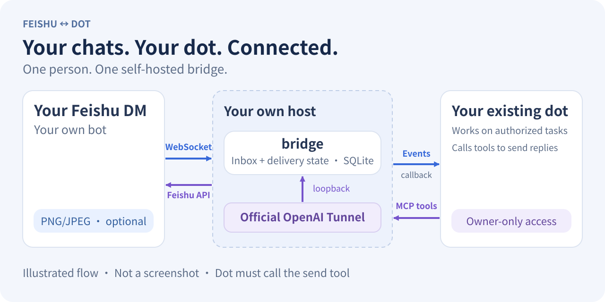

# Feishu ↔ dot

### Keep talking to your dot, from Feishu

Connect your own Feishu bot DM to the dot you already use. Send a question from Feishu, let dot work on it, and bring an authorized text reply back to the original message. With image input enabled, dot can also view newly received PNG/JPEG images. Optional image output sends explicitly requested current generated images to the same paired DM; callers submit status cards explicitly.

**One personal installation, on your own host.** Bring your Feishu app and owner-only official OpenAI Tunnel. The bridge connects them; it does not run a model or provide a shared hosted service.

[中文](README.md) · [Get started](docs/DEPLOYMENT.md) · [Features](#what-you-can-do) · [Security](SECURITY.md)

- **A familiar chat entry point:** continue with dot in your existing Feishu DM.
- **Your deployment to manage:** control the host, app configuration and database.
- **Delivery states you can check:** distinguish queued, API-accepted and uncertain results.

<picture>
  <source media="(max-width: 600px)" srcset="docs/assets/bridge-flow.en.mobile.svg">
  
</picture>

*Original diagram, not a product screenshot. Event notifications and tool calls use different paths. Feishu WebSocket intake needs no public event callback; replies still require dot to call the send tool.*

## What you can do

| Your goal | What the bridge connects |
| --- | --- |
| Continue from Feishu | Receive text and rich posts in your paired bot DM and notify your existing dot; links in posts stay unopened |
| Bring the answer back | Dot calls `reply_to_feishu` to reply to the original message; authorized ChatGPT text can also be sent as a source-labeled copy to the current paired DM |
| Show dot an image | Opt-in PNG/JPEG input, including up to four new embedded post images, locally stripped of metadata and re-encoded |
| Bring back a current generated image | Opt-in PNG/JPEG output: a trusted adapter supplies actual image bytes for upload and message delivery, with separate receipts |
| Share task status | Explicit processing, confirmation wait, completion, failure or blocked cards; ordinary updates PATCH one card, important waits send a new card, and the button only opens the official dot entry |
| See which inputs are handled | Per-event processing, approval waits, no-reply decisions and merged-reply coverage, alongside separate queue and API acceptance states |
| Run on your own host | SQLite-backed inbox and delivery state with host process supervision; one owner, Feishu app and current DM binding per installation |

The default catalog has **16 MCP tools**, including status submission and output queries. `FEISHU_MEDIA_INPUT=images-v1` adds `get_event_image`; `FEISHU_IMAGE_OUTPUT=on` adds two image staging/sending tools. Input alone gives 17 tools, output alone 18, and both enabled 19. Input and output are separate opt-ins limited to bounded PNG/JPEG. Image processing, disclosure and status sends still require explicit authorization. Audio and transcription are unsupported. The bridge does not automatically capture every dot answer or approval; clicking a Feishu card does not approve dot permissions.

## Before you start

- **Host:** Linux/macOS, Node.js 24+, npm, persistent disk, process supervision and outbound HTTPS/WebSocket access. Image mode additionally needs Linux `/usr/bin/prlimit` and the pinned `sharp` dependencies.
- **Feishu:** your own app, verified app/tenant and private-message permissions. Use one event consumer per app and one bridge process per database.
- **Dot:** an existing dot and an owner-only official OpenAI Tunnel. Your actual account must support the required MCP Events and Tunnel combination; check the [deployment requirements](docs/DEPLOYMENT.md#1-选择和检查主机).

## Start from source

Use a fresh directory. Keep any existing installation's configuration and database intact:

```sh
git clone https://github.com/yaodiff/feishu-dot-bridge.git
cd feishu-dot-bridge
npm ci --ignore-scripts
npm run init:personal
```

Initialization builds the source and creates private configuration and unique random keys. It refuses to overwrite an existing `.env`, `config` or `data`. It does not create your Feishu app, Tunnel or platform permissions.

Then follow the [full deployment guide](docs/DEPLOYMENT.md):

1. **Configure Feishu.** Fill the verified app, tenant and App Secret locally. Confirm there is no competing consumer before enabling `websocketExclusiveConsumer`.
2. **Start and connect.** Run `node --env-file=.env dist/src/main.js`. Point your owner-only official Tunnel at `http://127.0.0.1:3000/mcp` and inject the local `X-Bridge-Token`. Keep the bridge on loopback.
3. **Pair, then authorize.** Connect in dot and verify the tool catalog. Ask dot for a pairing command and send it yourself to your bot DM. Confirm the binding, then authorize the event subscription and reply/text-copy scope.

UI authentication “None” means no separate OAuth flow; backend key validation remains mandatory. Do not share the personal Tunnel. For an existing installation, use the [backup and upgrade process](docs/DEPLOYMENT.md#7-租期备份与维护) rather than initializing again.

## Try it before relying on it

Short live checks have observed text flowing both ways, event recovery reads and one merged reply with recorded coverage; see the [real acceptance record](docs/ACCEPTANCE.md#live-merged-text-check-2026-10-10). An authorized live check also observed real image upload/send and status-card create/PATCH; see the [output acceptance boundaries](docs/ACCEPTANCE.md#live-explicit-output-check-2026-10-10). This is experimental software. Those checks do not establish uninterrupted availability or greater reliability than cloud hosting.

- **Dot initiates replies.** A dot answer does not create a Feishu reply. The caller checks for missing work on a wake; no independent automatic resend service is supplied.
- **Delivery states differ.** Callback acceptance does not prove dot processed an event. `pending` is queued; `sent` means API acceptance, not display/read confirmation. Verify the destination before retrying `uncertain` outcomes.
- **Recovery has limits.** It applies to persisted events and jobs. There is no history-backfill guarantee; subscriptions expire, and image references expire or disappear on restart. See [disconnect and recovery](docs/DEPLOYMENT.md#8-断连与恢复的范围).
- **Protect your data.** Data still passes through OpenAI. SQLite message bodies are not application-encrypted; credential detection can miss secrets, and metadata removal cannot detect secrets in pixels. Keep configuration, disks and backups private, and real messages and secrets out of source control.

The project targets personal bot DMs. Group routing, multi-user sharing, history backfill and native ChatGPT message capture are unsupported. See [security](SECURITY.md) and the [per-installation checklist](docs/ACCEPTANCE.md).

### Local checks

```sh
npm test
npm run demo
```

The full suite requires Linux, `/usr/bin/prlimit`, `openssl` and `mkfifo`. macOS text-runtime support does not imply full-suite support. Tests and demo use synthetic data and simulated services, not real Feishu or dot accounts; they do not replace live acceptance.

## Go deeper

| Next step | Documentation |
| --- | --- |
| Install, connect a Tunnel, back up or upgrade | [Personal deployment](docs/DEPLOYMENT.md) |
| Configure dot's processing and reply workflow | [Per-event handling](docs/EVENT_HANDLING.md) · [Owned reads](docs/OWNED_EVENT_READS.md) |
| Enable images or understand rich posts | [Image input](docs/MEDIA_INPUT_CANDIDATE.md) · [Rich posts](docs/RICH_POST_INPUT.md) |
| Send current generated images or explicit status cards | [Output delivery and media handoff](docs/OUTPUT_DELIVERY_CANDIDATE.md) |
| Send authorized ChatGPT text copies | [Text mirroring](docs/TEXT_MIRROR_V1.md) |
| Diagnose transport or clean old inbox history | [Transport configuration](docs/DEPLOYMENT.md#9-可选传输与兼容模式) · [Offline maintenance](docs/OFFLINE_MAINTENANCE.md) |
| Understand protocols, permissions and contribution | [Protocol](docs/PROTOCOL.md) · [Security](SECURITY.md) · [Contributing](CONTRIBUTING.md) |

## License

Source is [MIT](LICENSE). Image dependencies and prebuilt native components have separate licenses. Review the [third-party terms and obligations](docs/DEPENDENCY_LICENSES.md) before distribution.

See the [explicit output delivery candidate](docs/OUTPUT_DELIVERY_CANDIDATE.md) for current generated images and status cards. Image output is off by default; callers submit statuses explicitly. This does not automatically capture every dot answer or approval.
