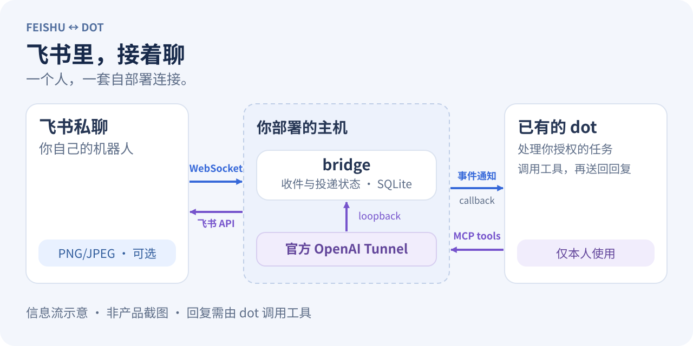
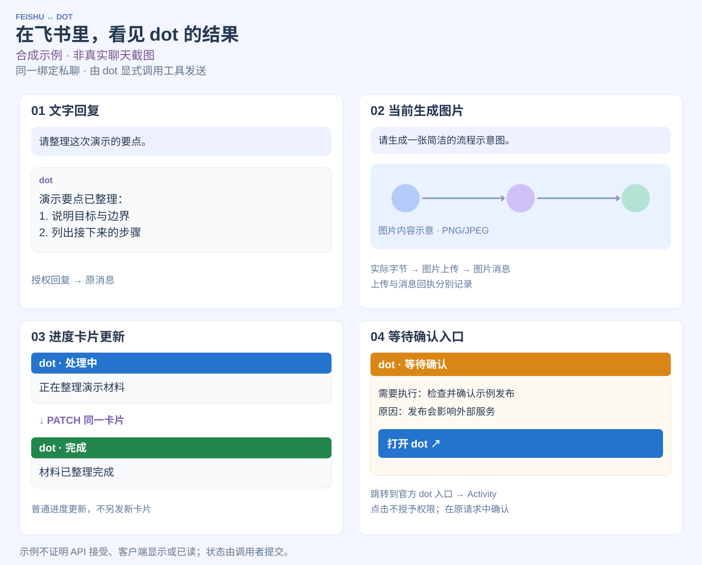

# Feishu ↔ dot

### 在飞书里，接着和你的 dot 聊

把自己的飞书机器人私聊，接到已经在用的 dot：从飞书发来问题，让 dot 处理，再把经你授权的文字回复送回原消息。开启图片输入后，也能把新收到的 PNG/JPEG 交给 dot 查看；开启图片输出后，可把明确要求的当前生成图片发回同一绑定私聊。状态卡片由调用者显式提交。

**每人自己部署一套。** 你提供飞书应用、主机和本人专属的官方 OpenAI Tunnel；bridge 负责连接，不运行模型，也不提供共享托管服务。

[English](README.en.md) · [开始部署](docs/DEPLOYMENT.md) · [功能](#能做什么) · [安全](SECURITY.md)

- **熟悉的聊天入口：** 用已有的飞书私聊继续和 dot 沟通。
- **自己部署和管理：** 主机、应用配置与数据库由你管理。
- **可核查的消息状态：** 看清排队、API 接受与待核对的投递结果。

<picture>
  <source media="(max-width: 600px)" srcset="docs/assets/bridge-flow.zh.mobile.svg">
  
</picture>

*原创信息流示意，非产品截图。事件通知与工具调用是不同路径；飞书 WebSocket 收信无需公开事件回调；回复仍需 dot 调用发送工具。*

## 能做什么

| 你想做的事 | bridge 提供的连接 |
| --- | --- |
| 从飞书继续对话 | 接收本人已绑定私聊的文字和富文本帖子，将新事件通知已有 dot；帖子里的链接不会自动打开 |
| 把答案带回飞书 | dot 调用 `reply_to_feishu`，回复固定回到原消息；授权的 ChatGPT 文字也可作为带来源标签的副本发送到当前绑定私聊 |
| 给 dot 看一张图 | 默认关闭的 PNG/JPEG 输入；支持新图片和帖子中最多四张内嵌图片，本地去元数据并重编码 |
| 带回当前生成图片 | 默认关闭的 PNG/JPEG 输出；通过受信适配器传入实际图片字节，真实上传并发送，分别核查上传与消息回执 |
| 同步任务状态 | 显式提交处理中、等待确认、完成、失败／阻塞卡片；普通进度更新同一卡片，重要等待另发，按钮只跳转到官方 dot 入口 |
| 看清哪些输入处理完了 | 逐事件记录处理中、等待授权、不回复及合并回复覆盖；分别查看排队、API 接受和不确定投递状态 |
| 在自己的主机运行 | 本地 SQLite 保存收件和投递状态，配合主机进程监管；一套安装、一个主人、一个飞书应用与当前私聊绑定 |

默认有 **16 个 MCP 工具**，包括状态提交与输出查询。`FEISHU_MEDIA_INPUT=images-v1` 增加 `get_event_image`；`FEISHU_IMAGE_OUTPUT=on` 增加图片分块暂存与发送两个工具。只开输入共 17 个，只开输出共 18 个，两者全开共 19 个。输入和输出分别启用，仅支持受限 PNG/JPEG；图片处理、披露与状态发送仍需明确授权。不支持语音或转写，也不会自动捕获所有 dot 回复或审批；飞书卡片点击不批准 dot 权限。

## 架构：两条独立通路

```text
[A] Intake + notification (authorized subscription; not a reply)
Feishu DM --WebSocket--> bridge --MCP Events / callback--> dot
                            |
                            +--> SQLite: inbox + handling ledger

[B] Authorized output (dot must call explicitly)
dot --MCP tools--> Official OpenAI Tunnel --loopback MCP--> bridge
                                                           |
                          Feishu DM <--Feishu API-----------+
                                                           |
                          SQLite: outbox + receipts <-------+
```

`[A]` 把新收件持久化并通知／唤醒 dot；callback 接受不表示处理完成。`[B]` 由 dot 经本人专属官方 Tunnel 调用工具，bridge 才会发送文字、受限 PNG/JPEG 或状态卡片。入站、处理决策、输出队列与回执分别记录；`sent` 只代表 API 接受，`uncertain` 不自动重发。bridge 不运行模型，也不会自动捕获所有 dot 回复或审批。

## 使用效果示例

<picture>
  <source media="(max-width: 600px)" srcset="docs/assets/usage-examples.zh.mobile.svg">
  
</picture>

*原创合成示例，非真实聊天截图，不包含用户私聊、账户或回执标识。布局用于说明行为，不保证各客户端呈现一致；真实验收另见[验收记录](docs/ACCEPTANCE.md)。*

| 示例 | 实际需要的调用与边界 |
| --- | --- |
| 文字回复 | `reply_to_feishu` 将经授权回复送回原消息 |
| 当前生成图片 | 受信适配器提供当前用户要求图片的实际字节；开启输出后暂存并真实上传／发送，分别检查两份回执。私有链接不能代替图片 |
| 进度更新 | 调用者显式提交状态；普通更新 PATCH 同一卡片，完成不是自动监听 dot 得出的结论 |
| 等待确认 | 重要等待另发卡片，写明动作与原因；按钮打开官方 dot 入口，用户在原 Activity 请求中确认，飞书点击不授予权限 |

图片输入和输出分别启用，仅支持受限 PNG/JPEG；不支持语音或转写。所有输出只面向本人的当前绑定私聊，仍需明确授权；这是个人自部署连接，不是共享托管服务。

## 开始前准备好

- **主机：** Linux/macOS、Node.js 24+、npm，以及持久磁盘、进程监管和必要的出站 HTTPS/WebSocket 连通性。图片模式另需 Linux `/usr/bin/prlimit` 和锁定的 `sharp` 依赖。
- **飞书：** 你自己的应用、已核实的 app/tenant 和私聊收发权限；同一应用只能有一个事件消费者，每个数据库只能有一个 bridge 进程。
- **dot：** 已有 dot 和仅本人可用的官方 OpenAI Tunnel；实际账号须支持所需的 MCP Events 与 Tunnel 组合，请先核对[部署要求](docs/DEPLOYMENT.md#1-选择和检查主机)。

## 从源码开始

在新目录中安装，不要覆盖已有实例的配置或数据库：

```sh
git clone https://github.com/yaodiff/feishu-dot-bridge.git
cd feishu-dot-bridge
npm ci --ignore-scripts
npm run init:personal
```

初始化会构建源码，生成私有 `.env`、应用配置和独立随机密钥；如果发现已有 `.env`、`config` 或 `data`，会拒绝覆盖。它不会替你创建飞书应用、Tunnel 或平台权限。

接着按[完整部署指南](docs/DEPLOYMENT.md)完成三个步骤：

1. **配置飞书。** 在本机填写应用、tenant 和 App Secret，核实没有其他消费者后启用 `websocketExclusiveConsumer`。
2. **启动并连接。** 运行 `node --env-file=.env dist/src/main.js`；配置本人专属官方 Tunnel，转发到 `http://127.0.0.1:3000/mcp` 并注入本地 `X-Bridge-Token`。bridge 保持 loopback 监听。
3. **配对再授权。** 在 dot 中连接并核对工具，让 dot 生成配对命令，由你发送到机器人私聊。确认绑定后，明确授权事件订阅及回复／文字副本范围。

连接界面的 “None” 只表示不另走 OAuth，后端密钥校验仍然必需。不能把个人 Tunnel 共享给其他人。运行中的旧实例升级请走[备份与迁移流程](docs/DEPLOYMENT.md#7-租期备份与维护)，不要重新初始化。

## 先试，再长期运行

短时实网检查已观察到文字双向流转、事件恢复读取和一次合并回复覆盖，详见[真实验收记录](docs/ACCEPTANCE.md#live-merged-text-check-2026-10-10)。当前生成图片的真实上传／发送及状态卡片创建／更新也已在一次授权实网检查中观察到，见[输出验收边界](docs/ACCEPTANCE.md#live-explicit-output-check-2026-10-10)。这是实验性项目，尚不能据此承诺全天稳定或比云端更可靠。

- **回复由 dot 发起。** dot 内的答案不会自动变成飞书回复；漏项检查由调用方在唤醒时执行，没有独立自动补发服务。
- **状态需要分开看。** callback 接受不代表 dot 已处理；`pending` 不是送达，`sent` 表示 API 接受而非客户端显示／已读，`uncertain` 必须先核对目的端。
- **恢复有范围。** 只恢复已持久化的事件和任务；没有历史回填保证，订阅有期限，图片引用会过期且重启后丢失。详见[断连与恢复](docs/DEPLOYMENT.md#8-断连与恢复的范围)。
- **数据需要保护。** 数据仍经过 OpenAI；SQLite 消息正文未做应用层加密，凭据检测可能漏报，图片去元数据不识别画面中的秘密。请保护配置、磁盘和备份，不把真实消息或秘密提交仓库。

当前面向个人机器人私聊，不支持群聊、多用户共享、历史回填或 ChatGPT 原生消息自动捕获。更多边界见[安全说明](SECURITY.md)与[逐安装验收清单](docs/ACCEPTANCE.md)。

### 本地检查

```sh
npm test
npm run demo
```

完整测试套件要求 Linux、`/usr/bin/prlimit`、`openssl` 和 `mkfifo`；macOS 文字运行时支持不等于完整套件支持。测试和 demo 使用合成数据与模拟服务，不连接真实飞书或 dot，也不能替代实网验收。

## 按需深入

| 接下来要做什么 | 文档 |
| --- | --- |
| 安装、连接 Tunnel、备份或升级 | [个人部署](docs/DEPLOYMENT.md) |
| 处理原生审批暂停与等待提醒 | [确认提醒与恢复边界](docs/WAIT_CONFIRMATION.md) |
| 配置 dot 的处理与回复流程 | [逐事件处理契约](docs/EVENT_HANDLING.md) · [本人事件读取](docs/OWNED_EVENT_READS.md) |
| 开启图片或了解帖子处理 | [图片输入](docs/MEDIA_INPUT_CANDIDATE.md) · [富文本帖子](docs/RICH_POST_INPUT.md) |
| 发送当前生成图片或显式状态卡片 | [输出投递与媒体交接](docs/OUTPUT_DELIVERY_CANDIDATE.md) |
| 发送授权的 ChatGPT 文字副本 | [文字镜像](docs/TEXT_MIRROR_V1.md) |
| 排查传输或清理旧收件记录 | [传输配置与诊断](docs/DEPLOYMENT.md#9-可选传输与兼容模式) · [离线维护](docs/OFFLINE_MAINTENANCE.md) |
| 理解协议、权限和发布要求 | [协议](docs/PROTOCOL.md) · [安全](SECURITY.md) · [贡献](CONTRIBUTING.md) |

## 许可证

源码采用 [MIT](LICENSE)。图片依赖与预编译原生组件另有许可证；分发前请核对[第三方许可与义务](docs/DEPENDENCY_LICENSES.md)。
